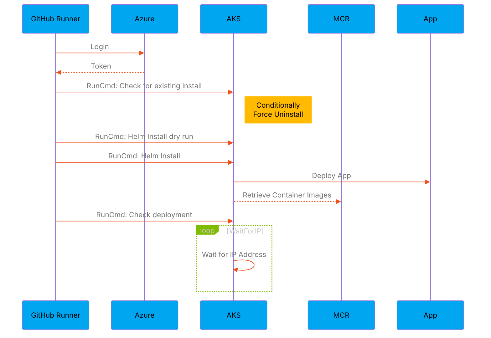
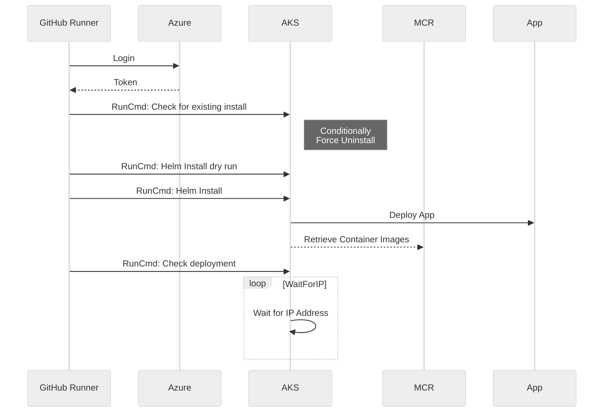
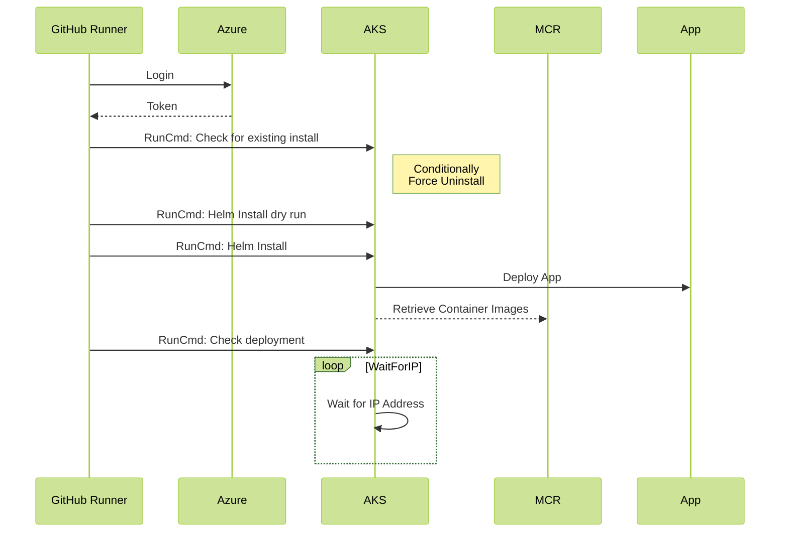
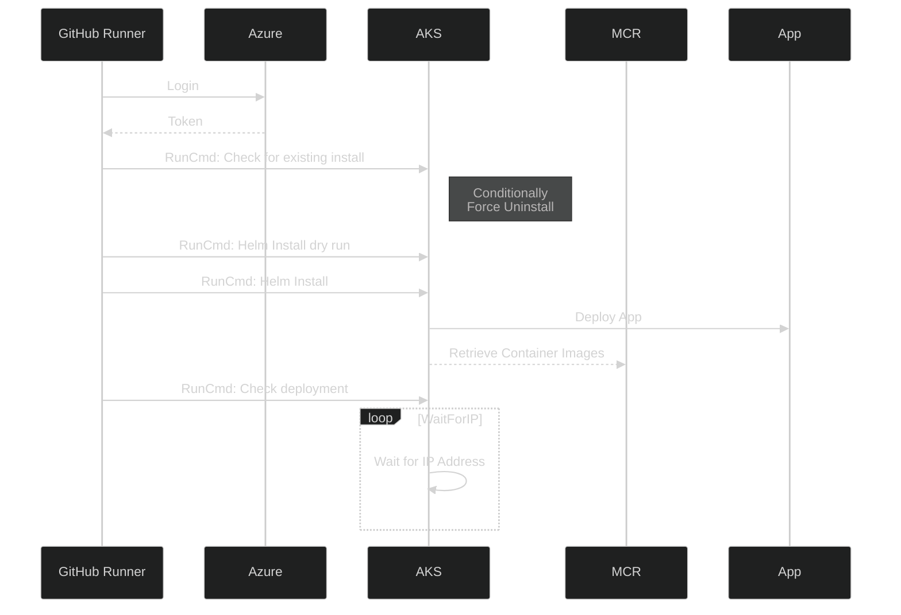
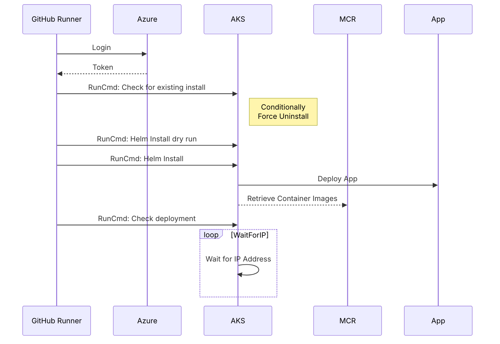

# MermaidTheming
Experimenting with mermaid diagram themes

## My main theme

Custom theme overrides using Microsoft Colour Palette

## Mermaid themes

Full list of default Mermaid themes... In the JS https://github.com/mermaid-js/mermaid/blob/b34f7bcdd5ccca50e30efef90de7f2be301000ba/src/themes/index.js
- base
- dark
- default
- forest
- neutral

### Neutral + dark mode

### Forest + darkMode

### Dark theme

## Fonts

It doesn't seem like the GitHub mermaid markdown rendering supports changing the font family or size

