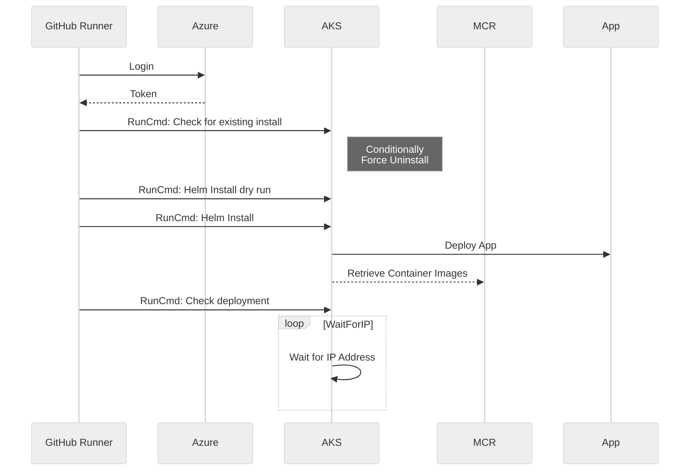
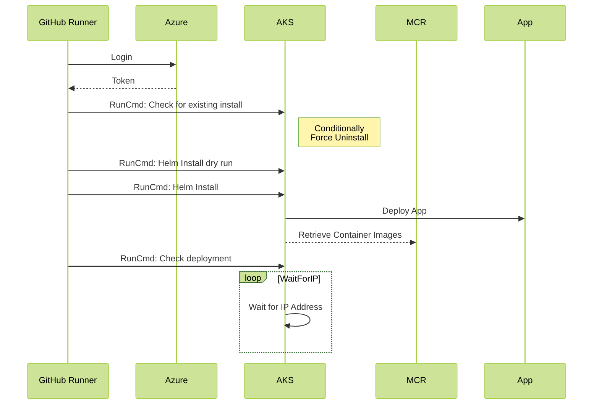

# MermaidTheming
Experimenting with mermaid diagram themes

Neutral + dark mode

```mermaid
%%{init: {'theme': 'neutral', 'themeVariables': {'darkMode': true}, "flowchart" : { "curve" : "basis" } } }%%
sequenceDiagram
    participant GitHub Runner
    participant Azure
    participant AKS
    participant MCR
    participant App
    GitHub Runner->>Azure: Login
    Azure-->>GitHub Runner: Token
    GitHub Runner->>AKS: RunCmd: Check for existing install
    Note right of AKS: Conditionally<br/>Force Uninstall
    GitHub Runner->>AKS: RunCmd: Helm Install dry run
    GitHub Runner->>AKS: RunCmd: Helm Install
    AKS->>App: Deploy App
    AKS-->>MCR: Retrieve Container Images
    GitHub Runner->>AKS: RunCmd: Check deployment
    loop WaitForIP
        AKS->>AKS: Wait for IP Address
    end
```

Forest + darkMode

```mermaid
%%{init: {'theme': 'forest', 'themeVariables': {'darkMode': true}, "flowchart" : { "curve" : "basis" } } }%%
sequenceDiagram
    participant GitHub Runner
    participant Azure
    participant AKS
    participant MCR
    participant App
    GitHub Runner->>Azure: Login
    Azure-->>GitHub Runner: Token
    GitHub Runner->>AKS: RunCmd: Check for existing install
    Note right of AKS: Conditionally<br/>Force Uninstall
    GitHub Runner->>AKS: RunCmd: Helm Install dry run
    GitHub Runner->>AKS: RunCmd: Helm Install
    AKS->>App: Deploy App
    AKS-->>MCR: Retrieve Container Images
    GitHub Runner->>AKS: RunCmd: Check deployment
    loop WaitForIP
        AKS->>AKS: Wait for IP Address
    end
```
