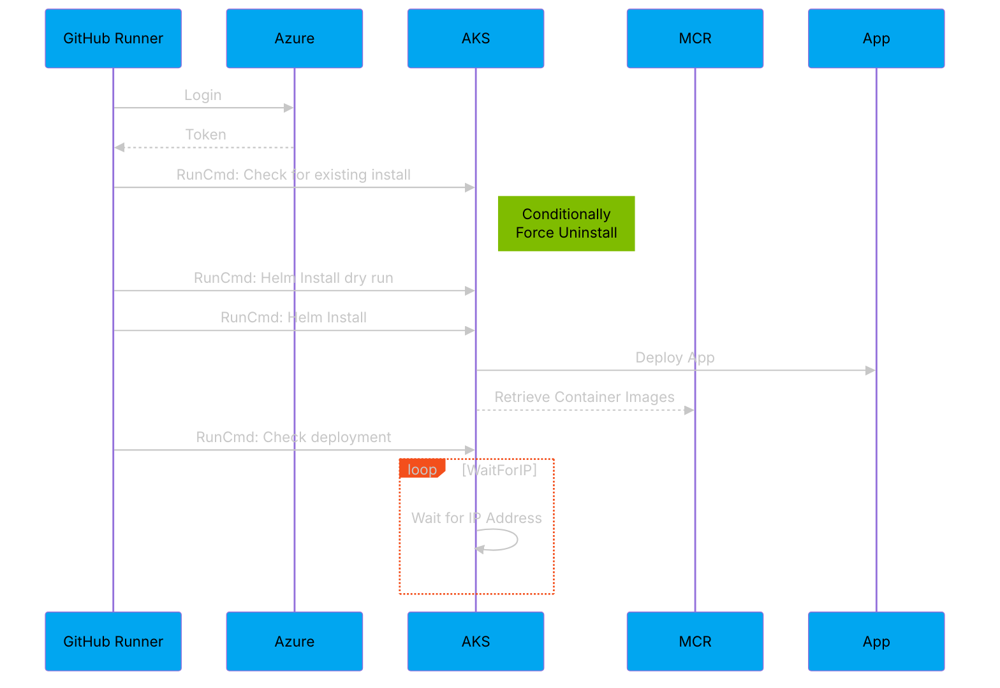
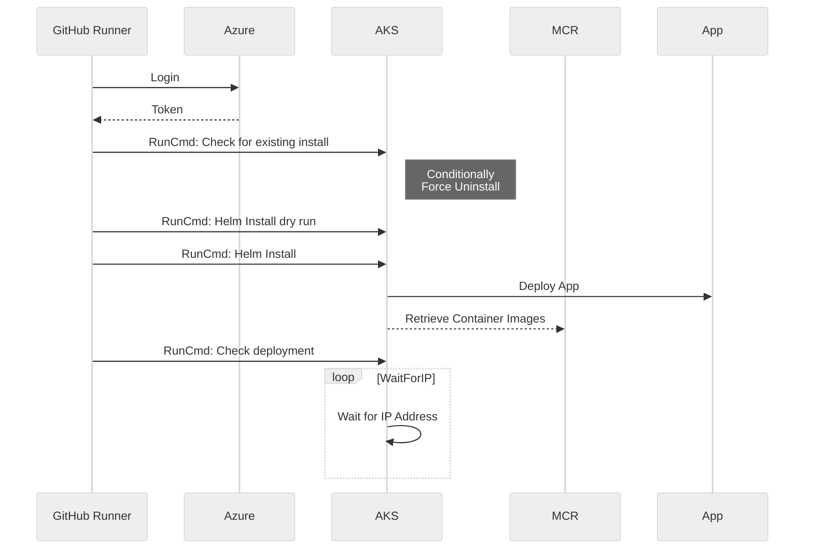
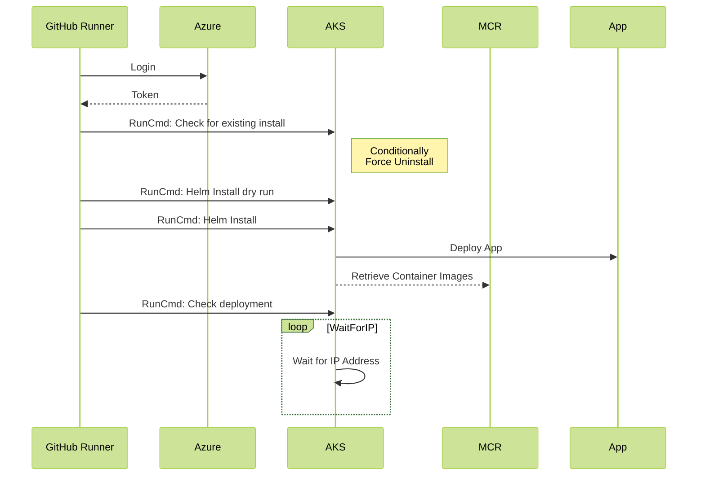

# MermaidTheming
Experimenting with mermaid diagram themes

Custom theme overrides using Microsoft Colour Palette

```mermaid
%%{init: 
{
  "theme": "default",
  "themeVariables": {
    "nodeBorder" : "#004990",
    "mainBkg" : "#c9d7e4",
    "actorBkg" : "#01A6F0",
    "textColor" : "#C7C7C7",
    "nodeTextColor" : "#274059",
    "loopTextColor" : "#C7C7C7",
    "labelTextColor" : "#C7C7C7",
    "labelBoxBorderColor" : "#F34F1C",
    "labelBoxBkgColor" : "#F34F1C",
    "noteBkgColor" : "#7FBC00",
    "noteBorderColor": "#7FBC00",
    "fontFamily": "Inter",
    "fontSize": "13px"
 }
}
}%%
sequenceDiagram
    participant GitHub Runner
    participant Azure
    participant AKS
    participant MCR
    participant App
    GitHub Runner->>Azure: Login
    Azure-->>GitHub Runner: Token
    GitHub Runner->>AKS: RunCmd: Check for existing install
    Note right of AKS: Conditionally<br/>Force Uninstall
    GitHub Runner->>AKS: RunCmd: Helm Install dry run
    GitHub Runner->>AKS: RunCmd: Helm Install
    AKS->>App: Deploy App
    AKS-->>MCR: Retrieve Container Images
    GitHub Runner->>AKS: RunCmd: Check deployment
    loop WaitForIP
        AKS->>AKS: Wait for IP Address
    end
```

Neutral + dark mode

```mermaid
%%{init: {'theme': 'neutral', 'themeVariables': {'darkMode': true}, "flowchart" : { "curve" : "basis" } } }%%
sequenceDiagram
    participant GitHub Runner
    participant Azure
    participant AKS
    participant MCR
    participant App
    GitHub Runner->>Azure: Login
    Azure-->>GitHub Runner: Token
    GitHub Runner->>AKS: RunCmd: Check for existing install
    Note right of AKS: Conditionally<br/>Force Uninstall
    GitHub Runner->>AKS: RunCmd: Helm Install dry run
    GitHub Runner->>AKS: RunCmd: Helm Install
    AKS->>App: Deploy App
    AKS-->>MCR: Retrieve Container Images
    GitHub Runner->>AKS: RunCmd: Check deployment
    loop WaitForIP
        AKS->>AKS: Wait for IP Address
    end
```

Forest + darkMode

```mermaid
%%{init: {'theme': 'forest', 'themeVariables': {'darkMode': true}, "flowchart" : { "curve" : "basis" } } }%%
sequenceDiagram
    participant GitHub Runner
    participant Azure
    participant AKS
    participant MCR
    participant App
    GitHub Runner->>Azure: Login
    Azure-->>GitHub Runner: Token
    GitHub Runner->>AKS: RunCmd: Check for existing install
    Note right of AKS: Conditionally<br/>Force Uninstall
    GitHub Runner->>AKS: RunCmd: Helm Install dry run
    GitHub Runner->>AKS: RunCmd: Helm Install
    AKS->>App: Deploy App
    AKS-->>MCR: Retrieve Container Images
    GitHub Runner->>AKS: RunCmd: Check deployment
    loop WaitForIP
        AKS->>AKS: Wait for IP Address
    end
```
