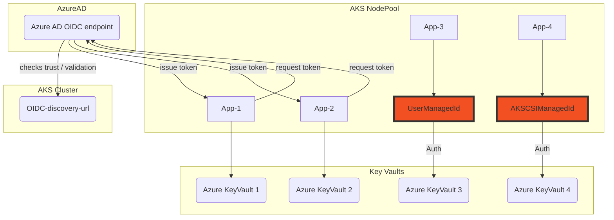

aks managed id

```mermaid
graph TB

    subgraph AzureAD
    aad(Azure AD OIDC endpoint)
    end
    subgraph Key Vaults
    kv1(Azure KeyVault 1)
    kv2(Azure KeyVault 2)
    kv3(Azure KeyVault 3)
    kv4(Azure KeyVault 4)
    end
    subgraph AKS Cluster
    ko(OIDC-discovery-url)
    end
    subgraph AKS NodePool
    App-1-->|request token|aad
    aad-->|checks trust / validation|ko
    aad-->|issue token|App-1
    App-1-->kv1
    App-2-->|request token|aad
    aad-->|issue token|App-2
    App-2-->kv2
    App-3-->UserManagedId
    App-4-->AKSCSIManagedId
    AKSCSIManagedId-->|Auth|kv4
    UserManagedId-->|Auth|kv3
    style UserManagedId fill:#F25022,stroke:#333,stroke-width:4px
    style AKSCSIManagedId fill:#F25022,stroke:#333,stroke-width:4px
    end
```
