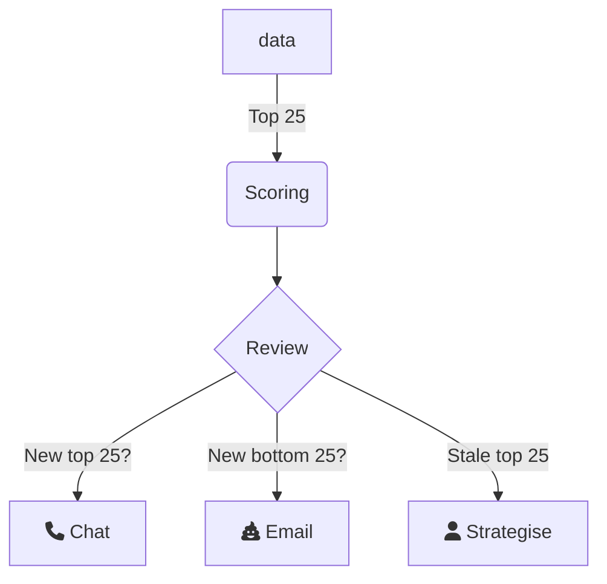

# Font Awesome

Some mermaid renderers support font awesome classes.

## GitHub

```mermaid
graph TD
    A[data] -->|Top 25| B(Scoring)
    B --> C{Review}
    C -->|New top 25?| D[fa:fa-phone Chat]
    C -->|New bottom 25?| E[fa:fa-poo Email]
    C -->|Stale top 25| F[fa:fa-user Strategise]
```
    
## Mermaid Live

